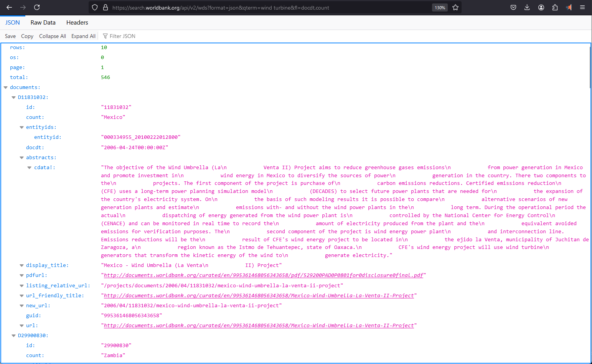

# Snowflake External Access: Retrieve Data from an API


Snowflake External Network access feature allows us to reach network sites outside of Snowflake. This access can be used within stored procedures and user-defined functions for a variety of purposes, including using an API or an external service.

External network access Feature is Generally Available now.

More Reads :: [External network access overview](https://docs.snowflake.com/en/developer-guide/external-network-access/external-network-access-overview)

## Architecture 

Let's look at the architecture used in Snowflake for external access before moving on to the particular example. There are four primary compoents:

1. A network rule governing the destinations to which traffic is permitted to flow.

2. The network rule can be utilized by Snowflake objects through an integration of external access.

3. An extra security feature that can be added to help with authentication. This typically uses a related Security Integration object that enables OAuth authentication with an API endpoint, or it makes use of a Snowflake Secret object that may securely store data, including a login and password.

4. A user defined function (UDF) or stored procedure that utilizes the external access integration is an example of a Snowflake object.


## Prerequisite

If you are using a trial account like me, you need to raise a support case request from within your Snowflake environment to get external access enabled for your trial account.

Following is a link to contact Snowflake support.

[Contacting Snowflake Support](https://docs.snowflake.com/user-guide/contacting-support)

The other prerequisite is a database and schema where we will create our database objects. My database is named "Test" and my schema is named "Ext_Access".

## External API

The World Bank offers an API that allows for the search and retrieval of the public, Bank documents available in the Documents & Reports site. Records can be retrieved in a format useful for research and for inclusion in web sites outside of Documents & Reports and the World Bank. 

I will use a World Bank API that does not require any API keys or other authentication method.

More Reads :: [The World Bank Documents & Report API](https://documents.worldbank.org/en/publication/documents-reports/api)

I will use the following API for the purposes of this blog.
https://search.worldbank.org/api/v2/wds?format=json&qterm=wind%20turbine&fl=docdt,count

If you copy paste this URL in your browser, you will see JSON payload.


Let's start.

## Step 1 - Configure an Outbound Network Rule

Network rules are database objects used by Snowflake to store data about a particular kind of network traffic. One of two categories could apply to this traffic:

1. Ingress – Traffic from outside of Snowflake that is coming in to Snowflake
2. Egress – Traffic that is leaving Snowflake and travelling outside

This rule encapsulates parameters such as MODE (e.g., EGRESS), TYPE (e.g., HOST_PORT), and VALUE_LIST (e.g., endpoint details).

More Reads :: [Creating a network rule to represent the external network location](https://docs.snowflake.com/en/developer-guide/external-network-access/creating-using-external-network-access#label-creating-using-external-access-integration-network-rule)

Our network rule is called "network_rule" and our API endpoint is search.worldbank.org.

```     
Create or Replace NETWORK RULE network_rule
MODE = EGRESS
TYPE = HOST_PORT
VALUE_LIST = ('search.worldbank.org')
```
## Step 2 - Create a Secret

Next, we create a secret containing the login credentials needed to authenticate with the external network location using the CREATE SECRET command. Passwords, usernames, and references to security integrations for OAuth flows are examples of secrets.

More Reads :: [Creating a secret to represent credentials](https://docs.snowflake.com/en/developer-guide/external-network-access/creating-using-external-network-access#label-creating-using-external-access-integration-secret)

However, in this particular instance, authentication is not required as we are using Public API. 

```     
CREATE OR REPLACE SECRET generic_secret
type = generic_string
SECRET_STRING = 'replace_with_your_API_key'
```

## Step 3 - Create an External Access Integration

The CREATE EXTERNAL ACCESS INTEGRATION command is used to aggregate the permitted network rules and secrets. The locations and login credentials that User-Defined Functions (UDFs) and procedures are allowed to utilize are specified by this integration.

More Reads :: [Creating an external access integration](https://docs.snowflake.com/en/developer-guide/external-network-access/creating-using-external-network-access#label-creating-using-external-access-integration-access-integration)

```     
CREATE OR REPLACE EXTERNAL ACCESS INTEGRATION worldbank_api
allowed_network_rules = (network_rule)
allowed_authentication_secrets = (generic_secret)
enabled = true;
```

Here, the name of our extrnal access integration is worldbank_api and we are configuring it to use the network rules and authentication secret we create in earlier steps.

## Step 4 - Create UDF or Procedure

We use the CREATE FUNCTION or CREATE PROCEDURE command and specify one or more integrations for the EXTERNAL_ACCESS_INTEGRATIONS parameter. 

More Reads :: [CREATE FUNCTION](https://docs.snowflake.com/en/sql-reference/sql/create-function)

We add the SECRETS parameter, which defines the secrets that can be retrieved from the handler code.


```     
CREATE OR REPLACE FUNCTION get_worldbank_data() 
RETURNS VARIANT 
LANGUAGE PYTHON 
RUNTIME_VERSION = 3.8 
HANDLER = 'get_worldbank_data_py' 
EXTERNAL_ACCESS_INTEGRATIONS = (worldbank_api) 
PACKAGES = ('snowflake-snowpark-python', 'requests') 
SECRETS = ('cred' = generic_secret) 
AS 
$$
## Imports
import snowflake.snowpark as snowpark
import requests

def get_worldbank_data_py():
    
    ### Define the endpoint URL
    url = "https://search.worldbank.org/api/v2/wds?format=json&qterm=wind%20turbine&fl=docdt,count"

    ### Execute API call
    response = requests.get(url)

    ### Only return something if the request is successful
    if response.status_code == 200:
        return response.json()
    else:
        raise Exception(f"Error. Response code: {str(response.status_code)}")
$$;
```

## Step 5 - Execute Snowflake Function

Let us execute the function that we create in earlier step.

```     
select get_worldbank_data() as json_data;
```

We will see JSON payload returned in a VARIANT data type.


## Step 6 - View JSON in editor

Let us view this JSON payload in editor. You will see documents node containing 11 nested json objects, which in turn contain json objects like abstracts,entityids etc.


Now, we can write some code in our Snowflake function to process/transform this data using Pandas dataframe. However, for this blog, we will do the same by writing our own SQL queries.

## Step 7 - Flatten JSON data

Let us flatten the JSON data.

In Snowflake, the FLATTEN table function flattens or explodes compound values into multiple rows, and is used to convert semi-structured data, such as JSON arrays, into a relational format, creating a set of rows from the elements of the array. This function is particularly useful when dealing with nested data structures, allowing us to work with and analyze data more easily.

More Reads :: [FLATTEN](https://docs.snowflake.com/en/sql-reference/functions/flatten)

```     
SELECT
    *
FROM
    TABLE(FLATTEN(input => get_worldbank_data())) AS json_result;
```


## Step 8 - Create table

Let us create a table to store this JSON data in a VARIANT column.

```     
create or replace table temp (json_data variant)
```

## Step 9 - Insert JSON data into table

```     
insert into
    temp
SELECT
    *
FROM
    (
        SELECT
            get_worldbank_data()
    );
```

## Step 10 - Flatten documents node

LATERAL FLATTEN function in Snowflake is used to transform semi-structured data, such as JSON, into a relational format. Specifically, it "flattens" nested arrays and objects into a set of rows, allowing us to work with the data more easily using SQL queries.

More Reads :: [LATERAL](https://docs.snowflake.com/en/sql-reference/constructs/join-lateral)

Let us flatten the documents node.

```     
select
    key,
    value
from 
    temp,
    LATERAL FLATTEN(input => json_data:documents) AS flattened
```


## Step 11 - Flatten again

In order to get to individual properties for each document node, we need to flatten again. To do this, we will use the same query as above, but use it as a CTE for our own query that will flatten data.

```     
with cte as
(
select
    key,
    value
from 
    temp,
    LATERAL FLATTEN(input => json_data:documents) AS flattened
)
select 
    cte.key,
    flattened2.key,
    flattened2.value::STRING
from 
    cte,
    LATERAL FLATTEN(input => value) AS flattened2;
```


Notice that we get 2 key columns, one from CTE and other from select query. The value column now shows individual properties for each key that is flattened in select query. 

We will now convert several rows for a document to just one, and display all properties for that document in different columns on same row. In other words, we will convert rows to column.

However, before we do that, please note that there are a few nested JSON objects like cdata and entityid in value column. We will not flatten these anymore, and just pick few values to show in our next query.

We will also do a transformation to remove any unnecessary spaces appearing in the data. 

## Step 12 - Pivot

In Snowflake, the PIVOT function is used to rotate rows into columns, effectively transforming the data to provide a different perspective, making it easier to analyze. 

More Reads :: [Pivot](https://docs.snowflake.com/en/sql-reference/constructs/pivot)

```     
with cte2 as (
    with cte as (
        select
            key,
            value
        from
            temp,
            LATERAL FLATTEN(input => json_data:documents) AS flattened
    )
    select
        cte.key as name,
        flattened2.key,
        --flattened2.value::STRING as value,
        REPLACE(flattened2.value, '  ', '')::STRING as value,
    from
        cte,
        LATERAL FLATTEN(input => value) AS flattened2
)
select
    *
from
    cte2 PIVOT (
        MAX(value) FOR key IN ('id', 'count', 'display_title', 'docdt', 'url')
    ) AS p (name, id, count, title, Document_date, URL)
```


## Summary

In this blog, we saw how to consume an external API, process and transform it, store it in a table, all in Snowflake.
 
I hope this blog gives you the tools you need to create your own UDTF to access data from external APIs. I intentionally chose a simpler example for this blog and therefore did not address challenges such as pagination, schema changes, or authentication. However, these are all challenges that are best addressed in a standard Python/API article rather than an article about enabling external access from Snowflake.

Please let me know your thoughts, comments and any feedback about this blog.

Thanks for your time, and see you soon on another blog.