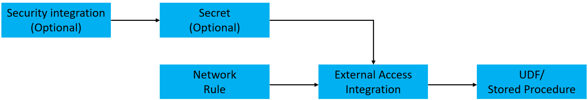
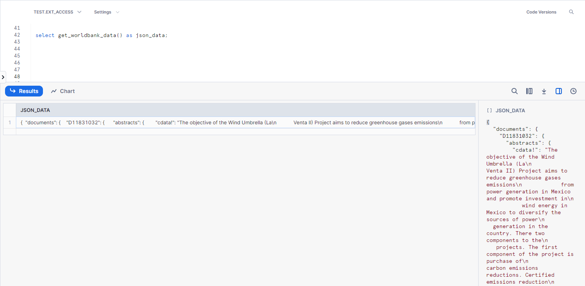
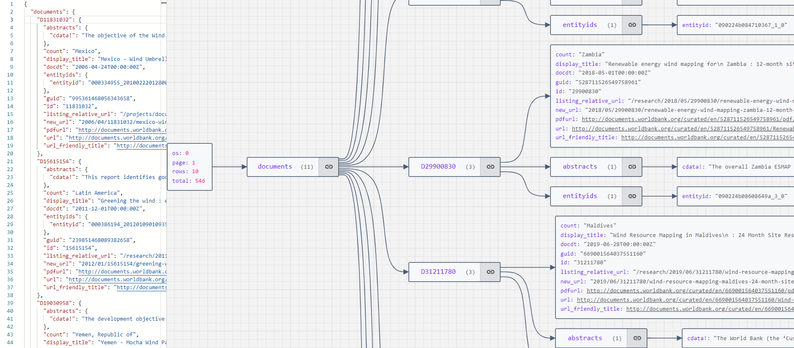
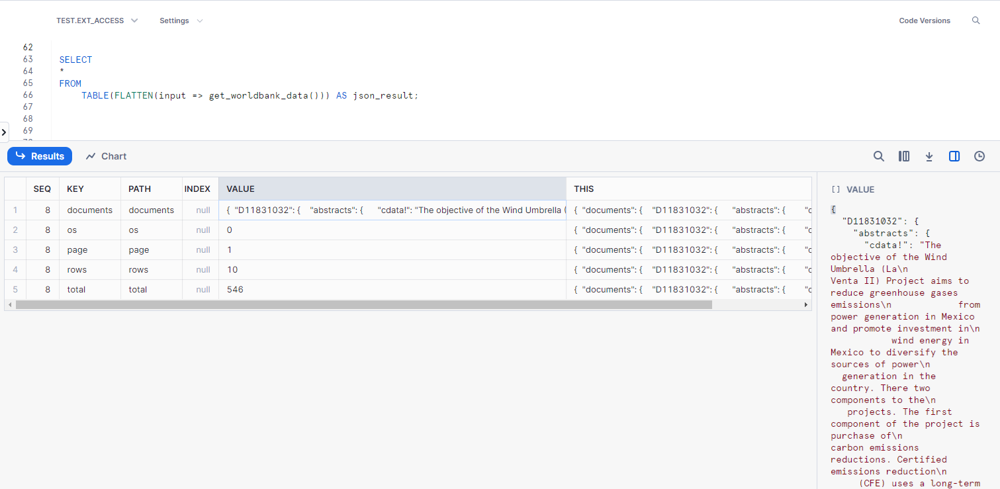
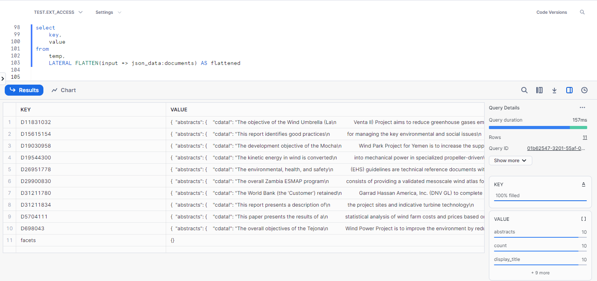
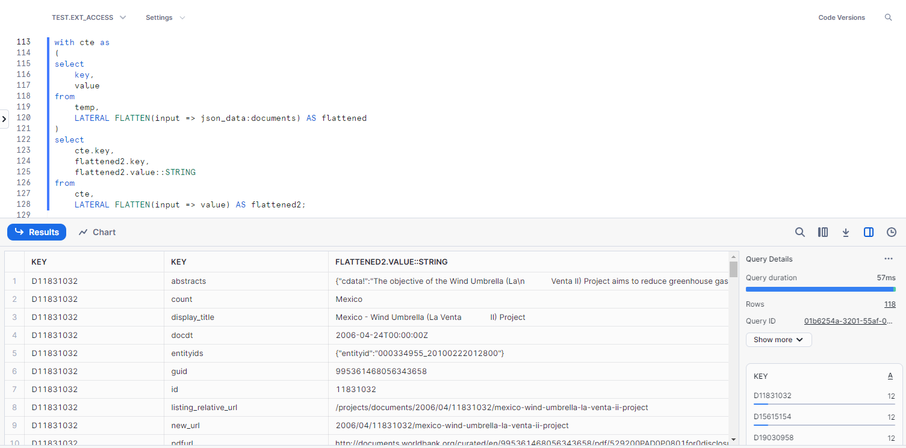
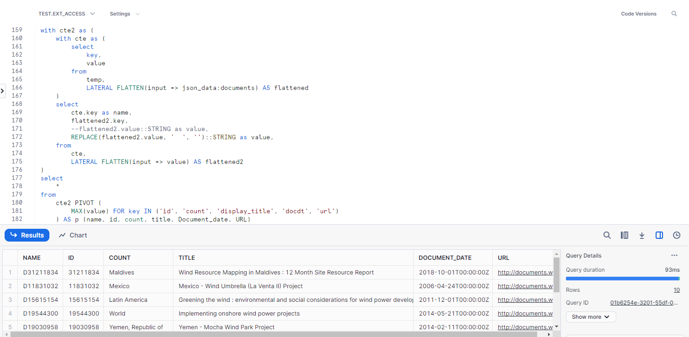

# Snowflake External Access: Retrieve Data from an API

Snowflake External Network access feature allows us to reach network sites outside of Snowflake. This access can be used within stored procedures and user-defined functions for a variety of purposes, including using an API or an external service.

External network access Feature is Generally Available now.

## Architecture 

Let's look at the architecture used in Snowflake for external access before moving on to the particular example. There are four primary compoents:

1. A network rule governing the destinations to which traffic is permitted to flow.

2. The network rule can be utilized by Snowflake objects through an integration of external access.

3. An extra security feature that can be added to help with authentication. This typically uses a related Security Integration object that enables OAuth authentication with an API endpoint, or it makes use of a Snowflake Secret object that may securely store data, including a login and password.

4. A user defined function (UDF) or stored procedure that utilizes the external access integration is an example of a Snowflake object.




## Prerequisite

If you are using a trial account like me, you need to request raise a support case request from within your Snowflake environment to get external access enabled for a trial account.

Following is a link to contact Snowflake support.

[Contacting Snowflake Support](https://docs.snowflake.com/user-guide/contacting-support)

The other prerequisite is a database and schema where we will create our database objects. My database is named "Test" and my schema is named "Ext_Access".

## External API


## Step 1 - Configure an Outbound Network Rule

Network rules are database objects used by Snowflake to store data about a particular kind of network traffic. One of two categories could apply to this traffic:

Ingress – Traffic from outside of Snowflake that is coming in to Snowflake
Egress – Traffic that is leaving Snowflake and travelling outside

```     
Create or Replace NETWORK RULE network_rule
MODE = EGRESS
TYPE = HOST_PORT
VALUE_LIST = ('search.worldbank.org')
```

## Step 2 - 

aaa

```     
CREATE OR REPLACE SECRET generic_secret
type = generic_string
SECRET_STRING = 'replace_with_your_API_key'
```

## Step 3 - 

aaa

```     
CREATE OR REPLACE EXTERNAL ACCESS INTEGRATION worldbank_api
allowed_network_rules = (network_rule)
allowed_authentication_secrets = (generic_secret)
enabled = true;
```

## Step 4 - 

aaa

```     
CREATE OR REPLACE FUNCTION get_worldbank_data()
RETURNS VARIANT
LANGUAGE PYTHON
RUNTIME_VERSION = 3.8
HANDLER = 'get_worldbank_data_py'
EXTERNAL_ACCESS_INTEGRATIONS = (worldbank_api)
PACKAGES = ('snowflake-snowpark-python','requests')
SECRETS = ('cred' = generic_secret)
AS
$$
import snowflake.snowpark as snowpark
import requests
import json

def get_worldbank_data_py():
    url = "https://search.worldbank.org/api/v2/wds?format=json&qterm=wind%20turbine&fl=docdt,count"
    response = requests.get(url)

    if response.status_code != 200:
        yeild ({'error':response})
    else:
        return response.json()
$$;
```

## Step 5 - 

aaa

```     
select get_worldbank_data() as json_data;
```



## Step 6 - 

aaa



## Step 7 - 

aaa

```     
SELECT
    *
FROM
    TABLE(FLATTEN(input => get_worldbank_data())) AS json_result;
```



## Step 8 - 

aaa

```     
create or replace table temp (json_data variant)
```


## Step 9 - 

aaa

```     
insert into
    temp
SELECT
    *
FROM
    (
        SELECT
            get_worldbank_data()
    );
```

## Step 10 - 

aaa

```     
select
    key,
    value
from 
    temp,
    LATERAL FLATTEN(input => json_data:documents) AS flattened
```



## Step 11 - 

aaa

```     
with cte as
(
select
    key,
    value
from 
    temp,
    LATERAL FLATTEN(input => json_data:documents) AS flattened
)
select 
    cte.key,
    flattened2.key,
    flattened2.value::STRING
from 
    cte,
    LATERAL FLATTEN(input => value) AS flattened2;
```




## Step 11 - 

aaa

```     
with cte2 as (
    with cte as (
        select
            key,
            value
        from
            temp,
            LATERAL FLATTEN(input => json_data:documents) AS flattened
    )
    select
        cte.key as name,
        flattened2.key,
        --flattened2.value::STRING as value,
        REPLACE(flattened2.value, '  ', '')::STRING as value,
    from
        cte,
        LATERAL FLATTEN(input => value) AS flattened2
)
select
    *
from
    cte2 PIVOT (
        MAX(value) FOR key IN ('id', 'count', 'display_title', 'docdt', 'url')
    ) AS p (name, id, count, title, Document_date, URL)
```



## Summary

In this blog, we saw the power of infer_schema table function for schema detection. Adding some intelligent code on top of the output from infer_schema, it is supe easy to ingest hundreds of CSV file automatically, thus saving time and effort, improving efficiency and avoiding any errors that may be caused by following a manual process to achieve the same result.

Please feel free to modify and use this code for your purposes, and let me know your thoughts, comments and any feedback about this blog.

Thanks for your time, and see you soon on another blog.